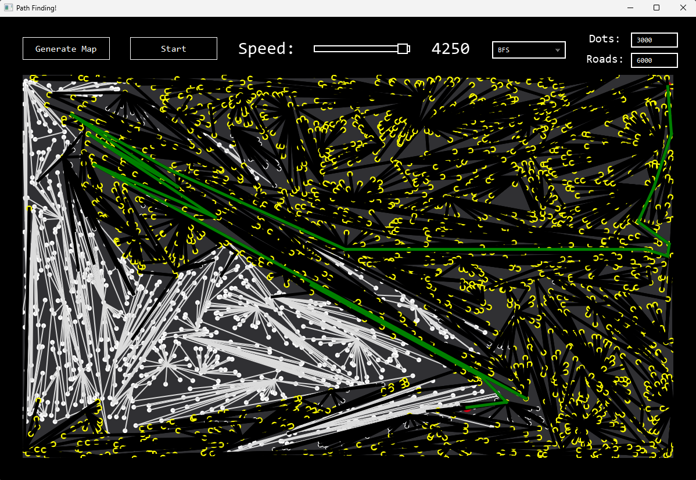
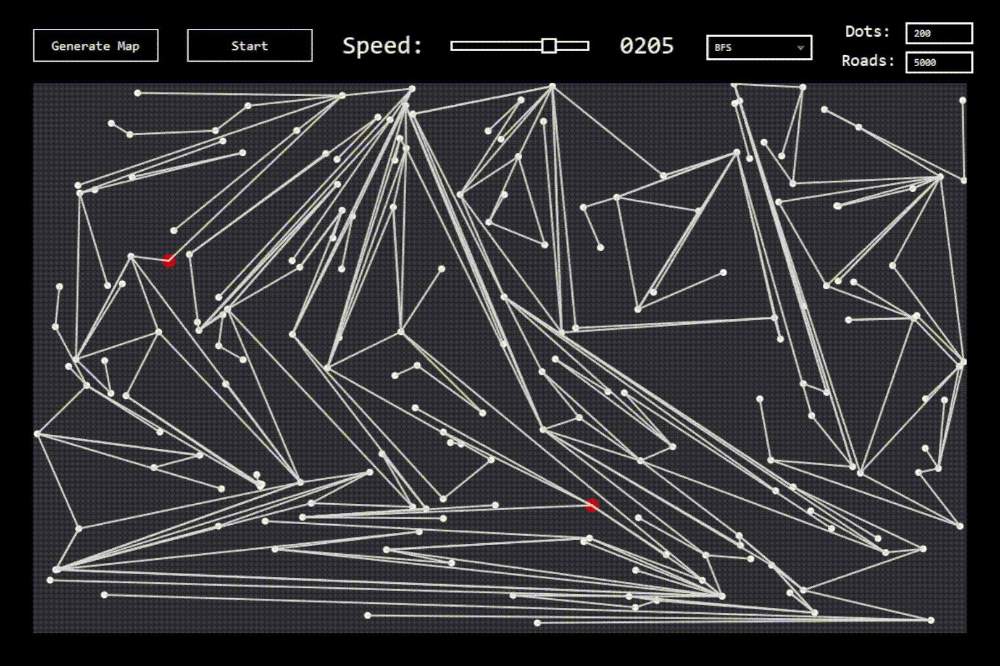
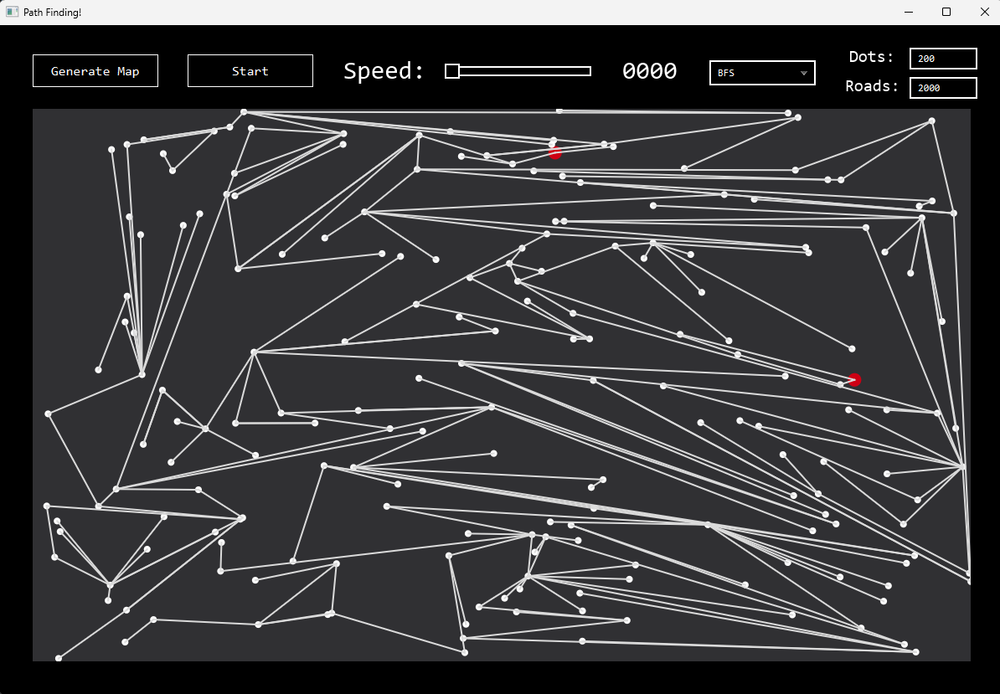
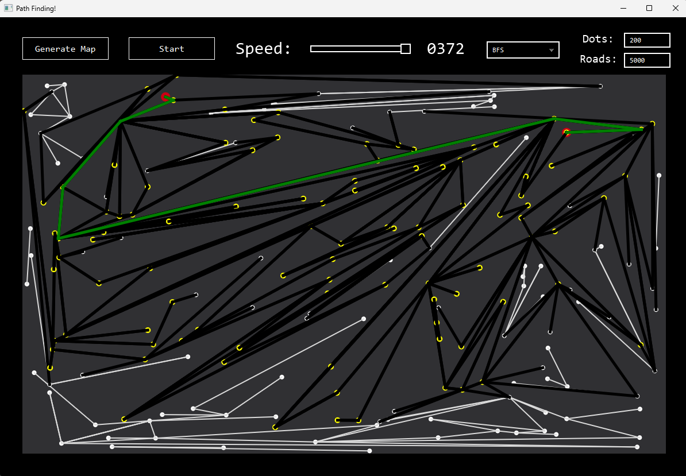

# JavaFX Pathfinding Visualizer

A JavaFX application to visualize **DFS** and **BFS** pathfinding algorithms on randomly generated maps. Customize the number of points, road generation attempts, and animation speed.

## New
- Added bfs check if generated map is possible, now data is alway correct!
- Works with higher amount of dots. Works with <1 secong map generation time up to 3000 dots and 6000 road tries!



## Features

- Generate random maps with adjustable number of points.
- Set the number of road attempts between points.
- Choose **DFS** or **BFS** algorithms for pathfinding.
- Asynchronous pathfinding with animated drawing.
- Adjustable animation speed.

### Path finding process



## Screenshots

### Randomly Generated Map


### DFS Pathfinding


### BFS Pathfinding



## How to Use

1. Clone this repository:

```bash
git clone https://github.com/RobertsRob/PathFindingJavaFXApp.git
```
